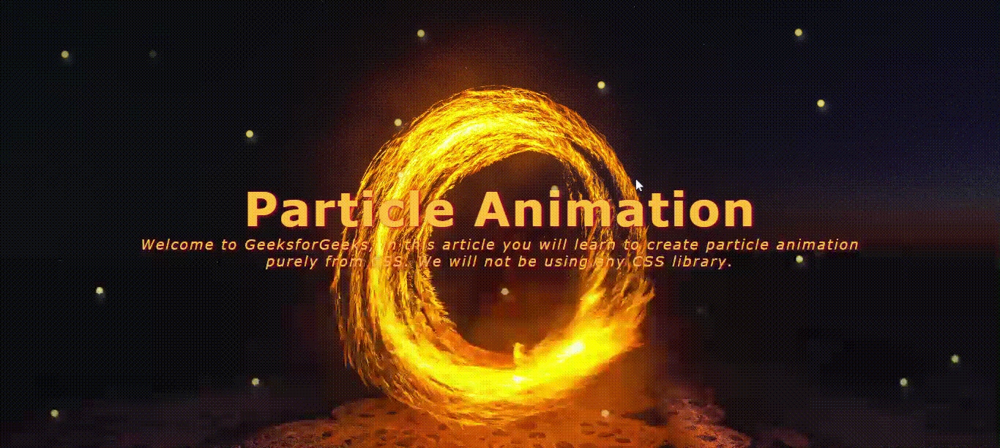

# Pure-CSS-Particle-Animation
You will see a particle animation applied on a division tag that covers full screen. The animation has been created using only pure HTML and CSS, i.e., no libraries or frameworks have been used. Not even JavaScript has been used. The image used in this project was downloaded from <a href="https://www.pexels.com/">Pexels</a>, bu searching for the keyword, "fire". The image is free to download and does not have copyright. To support such websites, it is good to mention their name and give them credits for their work.

